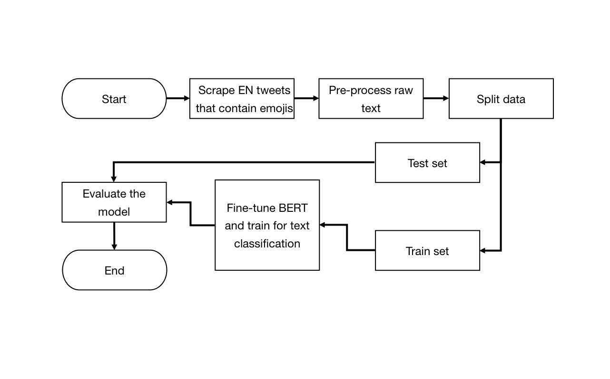

# Emoji prediction based on Tweets

## 1 Project Description

This project primarily involves training a BERT model through fine-tuning using a dataset comprising 400000 tweets containing a total of 20 different emojis. The objective is to achieve text classification. After users input a sentence, the model performs sentiment analysis based on the text's content and provides the corresponding emoji for the text.

## 2 Data

The project uses 20000 tweets per emoji from 20 emojis in total ([link to the dataset](https://www.kaggle.com/datasets/ericwang1011/tweets-with-emoji)).

## 3 Method

  

## 4 Code

1. [Data preprocessing](https://colab.research.google.com/drive/1UVthi_qhk3j8ywJDSliaKkgDmKj3eZbs?usp=sharing)
2. [Fine-tuning BERT](https://colab.research.google.com/drive/11M43DOmSD3ocIkEgledFw3mIKc0qABCk?usp=sharing)
3. [Keyword matching](https://colab.research.google.com/drive/1Aw7oTKHWEIBfO8-yjeXIPSQP8ME8F-W-?usp=sharing)
4. [Running](https://colab.research.google.com/drive/1BtDn07Sc9llbf-i9W5IWZ8o082AqduTF?usp=sharing)
