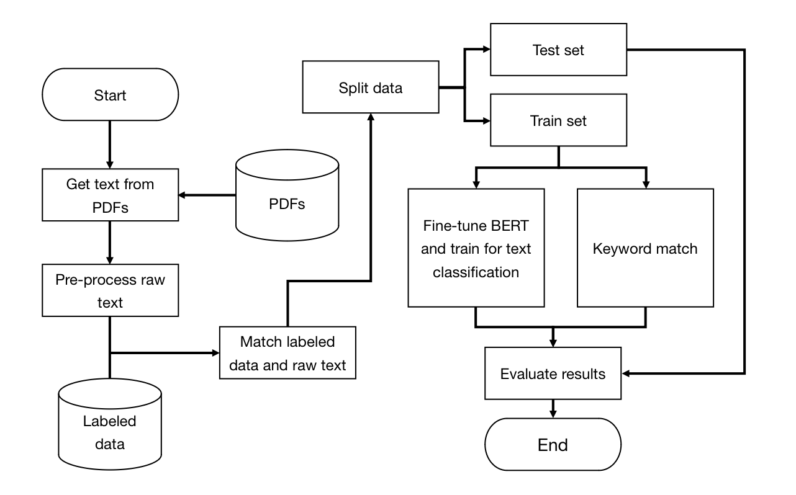

# Information Extraction from Annual Reports

## 1 Project Description

This project primarily focuses on extracting textual information from annual reports of real estate companies in PDF format. Subsequently, through fine-tuning the BERT model and combining keyword selection, the project involves classifying sentences to extract the required information.

## 2 Data

The project uses 600+ PDFs as the train set and 30+ PDFs as the test set (50000+ sentences after data cleaning).

## 3 Method

  

## 4 Code

1. [Data preprocessing](https://colab.research.google.com/drive/1UVthi_qhk3j8ywJDSliaKkgDmKj3eZbs?usp=sharing)
2. [Fine-tuning BERT](https://colab.research.google.com/drive/11M43DOmSD3ocIkEgledFw3mIKc0qABCk?usp=sharing)
3. [Keyword matching](https://colab.research.google.com/drive/1Aw7oTKHWEIBfO8-yjeXIPSQP8ME8F-W-?usp=sharing)
4. [Running](https://colab.research.google.com/drive/1BtDn07Sc9llbf-i9W5IWZ8o082AqduTF?usp=sharing)
